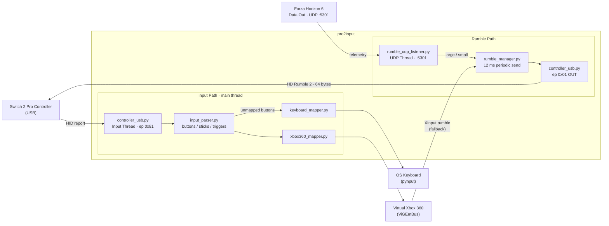
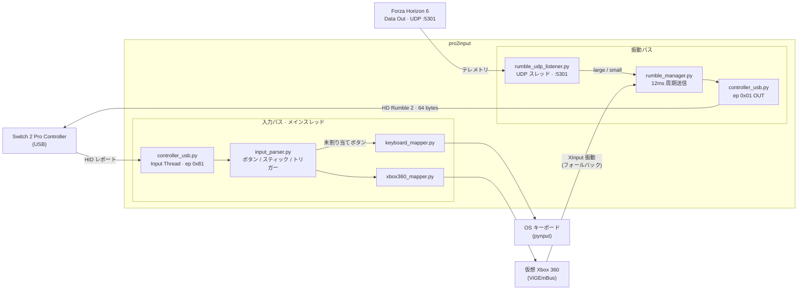

# Switch 2 Pro Controller to XInput Converter

[](https://www.python.org/)
[](LICENSE)
[](https://www.microsoft.com/windows)
[](https://github.com/packed7Ice/pro2input/stargazers)

[English](#english) | [日本語](#japanese)

---

<a id="english"></a>
## English

A Python-based USB input converter that maps **Nintendo Switch 2 Pro Controller** inputs to a virtual **Xbox 360 (XInput)** gamepad on Windows, with full HD Rumble 2 haptic feedback driven by **Forza Horizon 6 UDP telemetry**.

### Processing Flow



### Features

- **Full Button Mapping** — Face buttons, shoulder buttons, D-Pad, system buttons
- **Analog Stick Support** — Both left and right sticks with correct axis polarity
- **Trigger Synthesis** — ZL/ZR digital buttons mapped to analog LT/RT triggers
- **HD Rumble 2 Feedback** — Vibration via Interface 0 Interrupt OUT (ep 0x01), SDL-derived protocol
- **FH6 UDP Telemetry Rumble** — Forza Horizon 6 Data Out drives haptics (bypasses virtual controller limitation)
- **Auto-Reconnect** — Automatically recovers when the controller is disconnected and reconnected
- **Configurable via `config.json`** — Rumble strength, hold time, slip/surface scales and more

### Requirements

- Windows 10/11
- Python 3.10+
- Nintendo Switch 2 Pro Controller (USB connection)
- [ViGEmBus Driver](https://github.com/nefarius/ViGEmBus/releases) — virtual Xbox 360 controller
- [libusb-1.0.dll](https://libusb.info/) — place in `C:\Windows\System32`
- [Zadig](https://zadig.akeo.ie/) — install libusbK for Interface 0 **and** Interface 1
- For the desktop app (`ui-app/`): [Node.js](https://nodejs.org/) 18+ and [Rust](https://www.rust-lang.org/tools/install) — only needed to build/run it yourself, since no pre-built installer is published yet

### Installation

```bash
git clone https://github.com/packed7Ice/pro2input.git
cd pro2input
pip install -r requirements.txt
```

### Driver Setup (Zadig) — Critical

> Both Interface 0 and Interface 1 must use **libusbK**. This is the most common setup mistake.

1. Connect the Switch 2 Pro Controller via USB.
2. Open Zadig -> **Options -> List All Devices**.
3. Select **Nintendo Switch Pro Controller (Interface 0)** -> install **libusbK**.
4. Select **Nintendo Switch Pro Controller (Interface 1)** -> install **libusbK**.

The app uses pyusb for all USB access. The Windows HID driver (HidUsb) is not needed.

### Usage

#### Desktop App (recommended)

`ui-app/` is a Tauri (Rust + TypeScript) desktop UI: live controller/rumble
status, an in-app settings editor (button mapping, stick inversion, rumble,
FH6 UDP, keyboard mapping), and a system tray icon — closing the window
minimizes to tray instead of quitting, so the controller keeps working in
the background.

```bash
cd ui-app
npm install
npm run tauri dev      # development mode (spawns `python -m service.core_service` directly)
npm run tauri build    # production build: standalone installer (MSI/NSIS) in
                        # src-tauri/target/release/bundle/ — bundles the Python
                        # core via PyInstaller, no separate Python install needed to run it
```

Dev mode still runs on your local Python install, so `pip install -r requirements.txt` (see Installation above) is required for `npm run tauri dev`. A `npm run tauri build` installer is fully self-contained.

> **Always build/run through the `tauri` CLI** (`npm run tauri dev` / `npm run tauri build`), never bare `cargo build`/`cargo run` from `src-tauri/`. The CLI passes build-mode flags that decide whether the app loads the embedded frontend or the Vite dev server; a bare `cargo build --release` produces an exe that still tries to reach `http://localhost:1420` and fails with `ERR_CONNECTION_REFUSED` on launch since no dev server is running for it.

#### CLI / Headless

`main.py` also works standalone, without the desktop UI — useful for scripted or console-only use.

Double-click **`start.bat`** — the converter starts with FH6 UDP rumble enabled.

To disable UDP telemetry rumble (use XInput events only):

```bat
start_no_udp.bat
```

Or from the command line:

```bash
python main.py           # default: UDP rumble enabled
python main.py --no-udp  # XInput rumble only
```

### Forza Horizon 6 Rumble Setup

FH6 does not send vibration data to virtual controllers (ViGEmBus limitation). This project receives FH6's **Data Out** UDP telemetry and drives the physical rumble motors directly.

**In FH6:**
1. Settings -> HUD & Gameplay -> **Data Out** -> ON
2. **IP Address**: `127.0.0.1` (same PC)
3. **Port**: `5301`

Start the app (desktop UI or `python main.py`) — UDP packets are received automatically and drive the motors.

Verify packets are arriving:
```bash
python tools/fh6_udp_debug.py
```

### Configuration (`config.json`)

```json
{
  "rumble": {
    "enabled": true,
    "strength": 1.0
  },
  "fh6_udp": {
    "enabled": true,
    "port": 5301,
    "strength": 1.0,
    "smashable_threshold": 3.0,
    "slip_scale": 0.8,
    "surface_scale": 1.0,
    "timeout_ms": 300,
    "hold_ms": 150
  },
  "keyboard_mapping": {
    "Capture": "win+alt+prtsc",
    "CButton": null,
    "GRButton": null,
    "GLButton": null
  }
}
```

| Key | Description |
|-----|-------------|
| `rumble.strength` | Overall rumble multiplier (0.0-2.0) |
| `fh6_udp.strength` | UDP rumble multiplier (0.0-2.0) |
| `fh6_udp.smashable_threshold` | Collision speed (m/s) to trigger full rumble |
| `fh6_udp.slip_scale` | Tire slip -> high-frequency motor scale |
| `fh6_udp.surface_scale` | Road surface -> low-frequency motor scale |
| `fh6_udp.timeout_ms` | Silence motors if no UDP packet for this long |
| `fh6_udp.hold_ms` | Sustain rumble for this long after value drops to zero |

### Keyboard Mapping for Unmapped Buttons

The following Switch 2 Pro buttons have no Xbox 360 equivalent and can be mapped to any keyboard key or shortcut:

| Button | Description | Default |
|--------|-------------|---------|
| `Capture` | Screenshot button | `win+alt+prtsc` (Xbox Game Bar screenshot) |
| `CButton` | Game chat button | `null` (disabled) |
| `GRButton` | Right back grip button | `null` (disabled) |
| `GLButton` | Left back grip button | `null` (disabled) |

Edit `keyboard_mapping` in `config.json` to assign any combo:

```json
"keyboard_mapping": {
  "Capture": "win+alt+prtsc",
  "CButton": "win+g",
  "GRButton": "f12",
  "GLButton": "ctrl+shift+s"
}
```

Supported modifiers: `ctrl`, `shift`, `alt`, `win`

Supported special keys: `f1`-`f15`, `prtsc`, `esc`, `tab`, `enter`, `backspace`, `delete`, `home`, `end`, `pgup`, `pgdn`, `space`, `up`, `down`, `left`, `right`, and any single character.

Requires `pynput`:
```bash
pip install pynput
```

### Project Structure

```
pro2input/
├── main.py                      # CLI entry point
├── start.bat                    # Launch with UDP rumble (CLI)
├── start_no_udp.bat             # Launch without UDP rumble (CLI)
├── requirements.txt              # Python dependencies
├── config.json                  # User configuration
├── core/
│   ├── constants.py             # USB constants, init commands, rumble packet spec
│   ├── controller_usb.py        # pyusb I/O: input thread + rumble via ep 0x01
│   ├── input_parser.py          # Button/stick/trigger parsing
│   ├── rumble_manager.py        # Rumble state, 12ms periodic send, EncodeHDRumble
│   ├── rumble_udp_listener.py   # FH6 UDP telemetry -> rumble values
│   └── keyboard_mapper.py       # Unmapped buttons -> keyboard combos (pynput)
├── mapping/
│   └── xbox360_mapper.py        # Virtual Xbox 360 gamepad
├── config/
│   └── settings.py              # JSON config loader
├── service/                     # Headless backend for the desktop app
│   ├── core_service.py          # Same device/rumble/mapping orchestration as main.py
│   │                             # + a WebSocket status/settings server for ui-app/
│   ├── status_server.py         # WebSocket broadcaster + settings command handler
│   ├── settings_handler.py      # get/set/reset_settings over that WebSocket
│   └── pyinstaller/              # PyInstaller spec to freeze core_service.py
├── ui-app/                      # Tauri (Rust + TypeScript) desktop UI
├── tools/                       # Diagnostic scripts
└── docs/                        # Technical documentation
```

### Tools

| Script | Purpose |
|--------|---------|
| `tools/button_test.py` | Verify button mapping |
| `tools/stick_raw_diagnostic.py` | Inspect raw stick values |
| `tools/xinput_rumble_test.py` | Send test vibration via XInput |
| `tools/fh6_udp_debug.py` | Live FH6 UDP packet inspector |
| `tools/fh6_rumble_debug.py` | Log FH6 XInput rumble events |
| `tools/rumble_comprehensive_test.py` | Multi-endpoint rumble diagnostic |

### Troubleshooting

**Controller not found**
- Confirm both Interface 0 and Interface 1 are libusbK in Zadig.
- Reconnect the controller and retry.

**No input in games**
- `main.py` must be running — the virtual controller only exists while the script is active.
- Confirm ViGEmBus is installed.

**No vibration**
- Confirm both Interface 0 and Interface 1 are libusbK (not HidUsb or WinUSB).
- Run `tools/rumble_comprehensive_test.py` to test endpoints directly.
- For FH6: confirm Data Out is enabled and port is 5301. Check with `tools/fh6_udp_debug.py`.

**Vibration stops mid-game**
- USB errors are logged as `[USB] Rumble write failed`. If you see these, re-check Zadig.
- Increase `hold_ms` in `config.json` to 200-300 to smooth brief gaps.

**Conflicts with Steam Input**
- If Steam is running, Steam Input can grab the virtual Xbox 360 controller pro2input creates (and sometimes the raw Switch 2 Pro Controller too) and apply its own remapping on top, causing double/odd input. This happens at Steam's controller-capture layer, outside pro2input's control — there's no app-side fix.
- In Steam: **Settings -> Controller -> General Controller Settings**, uncheck **Xbox Configuration Support** (and **Nintendo Switch Pro Controller Configuration Support** if enabled) to stop Steam from capturing it globally.
- Or, per-game: right-click the game in your Library -> **Properties -> Controller** -> set **Override for \[Game]** to **Disable Steam Input**.

### Technical Notes

Vibration packets are sent to **Interface 0 Interrupt OUT (ep 0x01)**, not Bulk OUT.
This was discovered empirically via `tools/rumble_comprehensive_test.py`.

Packet layout (64 bytes, SDL-derived):
```
[0]     = 0x02  (Report ID)
[1]     = 0x50 | (seq & 0x0F)
[2:7]   = left actuator (5-byte EncodeHDRumble)
[17:23] = copy of [1:7]  (SDL: memcpy(&rumble_data[0x11], &rumble_data[0x01], 6))
```

The controller requires **continuous** 12ms packet delivery to sustain vibration.

### Acknowledgments

- Rumble protocol: **[SDL](https://github.com/libsdl-org/SDL)** [`SDL_hidapi_switch2.c`](https://github.com/libsdl-org/SDL/blob/main/src/joystick/hidapi/SDL_hidapi_switch2.c)
- USB init sequence: **[NSW2-controller-enabler](https://github.com/ikz87/NSW2-controller-enabler)** by ikz87
- HID report structure: **[Nintendo_Switch_Reverse_Engineering](https://github.com/dekuNukem/Nintendo_Switch_Reverse_Engineering)** by dekuNukem

### License

Apache License 2.0 — see [LICENSE](LICENSE).

---

<a id="japanese"></a>
## 日本語

**Nintendo Switch 2 Pro コントローラー**の入力を Windows 上で仮想 **Xbox 360（XInput）** ゲームパッドとして動作させる Python 製 USB 入力変換ツールです。**Forza Horizon 6 の UDP テレメトリ**を使った HD 振動2 フィードバックに対応しています。

### 処理フロー



### 機能

- **フルボタンマッピング** — フェイスボタン、ショルダーボタン、十字キー、システムボタン
- **アナログスティック対応** — 左右スティックともに正しい軸方向で動作
- **トリガー合成** — ZL/ZR のデジタルボタンをアナログ LT/RT トリガーに変換
- **HD 振動2 フィードバック** — Interface 0 Interrupt OUT（ep 0x01）経由、SDL 導出プロトコル
- **FH6 UDP テレメトリ振動** — Forza Horizon 6 の Data Out で振動モーターを直接駆動
- **自動再接続** — コントローラーを抜き差しすると自動的に再接続
- **`config.json` で設定可能** — 振動強度・ホールドタイム・スリップスケールなど

### 必要条件

- Windows 10/11
- Python 3.10 以降
- Nintendo Switch 2 Pro コントローラー（USB 接続）
- [ViGEmBus ドライバー](https://github.com/nefarius/ViGEmBus/releases) — 仮想 Xbox 360 コントローラー用
- [libusb-1.0.dll](https://libusb.info/) — `C:\Windows\System32` に配置
- [Zadig](https://zadig.akeo.ie/) — Interface 0 **と** Interface 1 の両方に libusbK をインストール
- デスクトップアプリ（`ui-app/`）を使う場合: [Node.js](https://nodejs.org/) 18 以降と [Rust](https://www.rust-lang.org/tools/install) — ビルド済みインストーラーは未配布のため、自分でビルド/実行する場合のみ必要

### インストール

```bash
git clone https://github.com/packed7Ice/pro2input.git
cd pro2input
pip install -r requirements.txt
```

### ドライバー設定（Zadig）— 重要

> **Interface 0 と Interface 1 の両方**を libusbK にする必要があります。これが最も多い設定ミスです。

1. Switch 2 Pro コントローラーを USB で接続します。
2. Zadig を開き -> **Options -> List All Devices**。
3. **Nintendo Switch Pro Controller (Interface 0)** を選択 -> **libusbK** をインストール。
4. **Nintendo Switch Pro Controller (Interface 1)** を選択 -> **libusbK** をインストール。

本アプリは全 USB アクセスに pyusb を使用します。Windows 標準 HID ドライバー（HidUsb）は不要です。

### 使い方

#### デスクトップアプリ（推奨）

`ui-app/` は Tauri（Rust + TypeScript）製のデスクトップUIです。コントローラー・振動のリアルタイム表示、アプリ内設定エディタ（ボタンマッピング・スティック反転・振動・FH6 UDP・キーボードマッピング）、システムトレイ常駐（ウィンドウを閉じても終了せずトレイに格納され、コントローラーは動作し続けます）に対応しています。

```bash
cd ui-app
npm install
npm run tauri dev      # 開発モード（`python -m service.core_service` を直接起動）
npm run tauri build    # 本番ビルド: スタンドアロンインストーラー（MSI/NSIS）を
                        # src-tauri/target/release/bundle/ に生成
                        # （PyInstaller でPythonコアも同梱するため、
                        # 実行にPythonの別途インストールは不要）
```

開発モード（`npm run tauri dev`）はローカルのPython環境をそのまま使うため、`pip install -r requirements.txt`（上記インストール参照）が必要です。`npm run tauri build` で生成したインストーラーは完全に自己完結しています。

> **必ず`tauri` CLI経由でビルド/実行してください**（`npm run tauri dev` / `npm run tauri build`）。`src-tauri/`で`cargo build`/`cargo run`を直接叩くのは避けてください。CLIが渡すビルドモード用フラグによって、埋め込みフロントエンドを読むかViteの開発サーバーを読むかが決まります。素の`cargo build --release`で作ったexeは開発サーバー用のURL（`http://localhost:1420`）を読みに行ってしまい、サーバーが起動していないため`ERR_CONNECTION_REFUSED`で起動に失敗します。

#### CLI / ヘッドレス

デスクトップUIを使わず `main.py` 単体でも動作します。スクリプトからの起動やコンソールのみの利用に便利です。

**`start.bat`** をダブルクリック — FH6 UDP 振動が有効な状態で起動します。

UDP テレメトリ振動を無効にする場合:

```bat
start_no_udp.bat
```

またはコマンドラインから:

```bash
python main.py           # デフォルト: UDP 振動有効
python main.py --no-udp  # XInput 振動のみ
```

### Forza Horizon 6 振動の設定

FH6 は ViGEmBus 仮想コントローラーに振動データを送りません（仮想コントローラーの制限）。本プロジェクトは FH6 の **Data Out** UDP テレメトリを受信し、物理的な振動モーターを直接制御します。

**FH6 内での設定:**
1. 設定 -> HUD & ゲームプレイ -> **Data Out** -> ON
2. **IP アドレス**: `127.0.0.1`（同じ PC の場合）
3. **ポート**: `5301`

アプリを起動する（デスクトップUI、または `python main.py`）と UDP パケットを自動受信し、モーターを制御します。

パケットが届いているか確認:
```bash
python tools/fh6_udp_debug.py
```

### 設定（`config.json`）

```json
{
  "rumble": {
    "enabled": true,
    "strength": 1.0
  },
  "fh6_udp": {
    "enabled": true,
    "port": 5301,
    "strength": 1.0,
    "smashable_threshold": 3.0,
    "slip_scale": 0.8,
    "surface_scale": 1.0,
    "timeout_ms": 300,
    "hold_ms": 150
  },
  "keyboard_mapping": {
    "Capture": "win+alt+prtsc",
    "CButton": null,
    "GRButton": null,
    "GLButton": null
  }
}
```

| キー | 説明 |
|------|------|
| `rumble.strength` | 全体の振動強度倍率（0.0〜2.0） |
| `fh6_udp.strength` | UDP 振動の強度倍率（0.0〜2.0） |
| `fh6_udp.smashable_threshold` | 衝突振動を発生させる速度差（m/s） |
| `fh6_udp.slip_scale` | タイヤスリップ -> 高周波モーターのスケール |
| `fh6_udp.surface_scale` | 路面振動 -> 低周波モーターのスケール |
| `fh6_udp.timeout_ms` | この時間（ms）UDP が来なければモーターを停止 |
| `fh6_udp.hold_ms` | 振動値がゼロになってもこの時間（ms）は振動を持続 |

### Xbox 360 に存在しないボタンのキーボードマッピング

以下の Switch 2 Pro ボタンは Xbox 360 に相当するボタンがなく、任意のキーボードショートカットに割り当てられます：

| ボタン | 説明 | デフォルト |
|--------|------|-----------|
| `Capture` | スクリーンショットボタン | `win+alt+prtsc`（Xbox ゲームバー スクリーンショット） |
| `CButton` | ゲームチャットボタン | `null`（無効） |
| `GRButton` | 右背面ボタン | `null`（無効） |
| `GLButton` | 左背面ボタン | `null`（無効） |

`config.json` の `keyboard_mapping` を編集して任意のキーコンボを設定できます：

```json
"keyboard_mapping": {
  "Capture": "win+alt+prtsc",
  "CButton": "win+g",
  "GRButton": "f12",
  "GLButton": "ctrl+shift+s"
}
```

対応するモディファイア: `ctrl`、`shift`、`alt`、`win`

対応する特殊キー: `f1`〜`f15`、`prtsc`、`esc`、`tab`、`enter`、`backspace`、`delete`、`home`、`end`、`pgup`、`pgdn`、`space`、`up`、`down`、`left`、`right`、および任意の1文字キー。

キーボードマッピングを使用するには `pynput` が必要です：
```bash
pip install pynput
```

### プロジェクト構成

```
pro2input/
├── main.py                      # CLI エントリーポイント
├── start.bat                    # UDP 振動あり起動（CLI）
├── start_no_udp.bat             # UDP 振動なし起動（CLI）
├── requirements.txt              # Python 依存パッケージ
├── config.json                  # ユーザー設定
├── core/
│   ├── constants.py             # USB 定数・初期化コマンド・振動パケット仕様
│   ├── controller_usb.py        # pyusb I/O: 入力スレッド + ep 0x01 振動送信
│   ├── input_parser.py          # ボタン・スティック・トリガー解析
│   ├── rumble_manager.py        # 振動状態管理・12ms 周期送信・EncodeHDRumble
│   ├── rumble_udp_listener.py   # FH6 UDP テレメトリ -> 振動値変換
│   └── keyboard_mapper.py       # 未割り当てボタン -> キーボード入力（pynput）
├── mapping/
│   └── xbox360_mapper.py        # 仮想 Xbox 360 ゲームパッド
├── config/
│   └── settings.py              # JSON 設定ローダー
├── service/                     # デスクトップアプリ用のヘッドレスバックエンド
│   ├── core_service.py          # main.py と同じ入出力・振動処理 +
│   │                             # ui-app/ 向け WebSocket ステータス/設定サーバー
│   ├── status_server.py         # WebSocket ブロードキャスト + 設定コマンド処理
│   ├── settings_handler.py      # get/set/reset_settings（WebSocket経由）
│   └── pyinstaller/              # core_service.py を単体exe化する PyInstaller spec
├── ui-app/                      # Tauri（Rust + TypeScript）製デスクトップUI
├── tools/                       # 診断スクリプト群
└── docs/                        # 技術ドキュメント
```

### ツール一覧

| スクリプト | 用途 |
|------------|------|
| `tools/button_test.py` | ボタンマッピングの確認 |
| `tools/stick_raw_diagnostic.py` | スティック生値の確認 |
| `tools/xinput_rumble_test.py` | XInput で振動テスト送信 |
| `tools/fh6_udp_debug.py` | FH6 UDP パケットのリアルタイム確認 |
| `tools/fh6_rumble_debug.py` | FH6 XInput 振動イベントのログ記録 |
| `tools/rumble_comprehensive_test.py` | 全エンドポイント振動診断 |

### トラブルシューティング

**コントローラーが認識されない**
- Zadig で Interface 0 と Interface 1 の両方が libusbK になっているか確認してください。
- コントローラーを抜き差しして再試行してください。

**ゲーム内で入力が効かない**
- `main.py` が実行中であることを確認してください（スクリプト実行中のみ仮想コントローラーが存在）。
- ViGEmBus が正しくインストールされているか確認してください。

**振動しない**
- Zadig で Interface 0 と Interface 1 の両方が **libusbK**（HidUsb や WinUSB ではない）か確認してください。
- `tools/rumble_comprehensive_test.py` でエンドポイントを直接テストしてください。
- FH6 の場合: Data Out が有効でポートが 5301 か確認。`tools/fh6_udp_debug.py` で確認できます。

**振動がゲーム中に止まる**
- USB エラーは `[USB] Rumble write failed` としてログに出ます。出ている場合は Zadig の設定を再確認してください。
- `config.json` の `hold_ms` を 200〜300 に増やすと短い振動の途切れが改善されます。

**Steam Input との競合**
- Steam が起動していると、pro2input が作る仮想 Xbox 360 コントローラー（場合によっては Switch 2 Pro コントローラー本体も）を Steam Input が捕捉し、独自のリマッピングを重ねてしまうことがあります。これは Steam 側のコントローラー捕捉の仕組みによるもので、pro2input 側での対処はできません。
- Steam の **設定 -> コントローラー -> 全般のコントローラー設定** で **Xbox 構成のサポート**（有効なら **Nintendo Switch Pro コントローラー構成のサポート** も）のチェックを外すと、Steam によるグローバルな捕捉を止められます。
- あるいはゲームごとに: ライブラリでゲームを右クリック -> **プロパティ -> コントローラー** -> 該当ゲームの上書き設定を **Steam入力を無効化** にしてください。

### 技術メモ

振動パケットは **Interface 0 Interrupt OUT（ep 0x01）** に送信します（Bulk OUT ではありません）。
`tools/rumble_comprehensive_test.py` の実験により判明しました。

パケットレイアウト（64 バイト、SDL 準拠）:
```
[0]     = 0x02  (Report ID)
[1]     = 0x50 | (seq & 0x0F)
[2:7]   = 左アクチュエータ（5 バイト EncodeHDRumble）
[17:23] = [1:7] のコピー（SDL: memcpy(&rumble_data[0x11], &rumble_data[0x01], 6)）
```

コントローラーのモーターは **12ms ごとに継続的にパケットを送り続けないと停止**します。

### 謝辞

- 振動プロトコル: **[SDL](https://github.com/libsdl-org/SDL)** [`SDL_hidapi_switch2.c`](https://github.com/libsdl-org/SDL/blob/main/src/joystick/hidapi/SDL_hidapi_switch2.c)
- USB 初期化シーケンス: **[NSW2-controller-enabler](https://github.com/ikz87/NSW2-controller-enabler)** by ikz87
- HID レポート構造: **[Nintendo_Switch_Reverse_Engineering](https://github.com/dekuNukem/Nintendo_Switch_Reverse_Engineering)** by dekuNukem

### ライセンス

Apache License 2.0 — [LICENSE](LICENSE) を参照してください。
